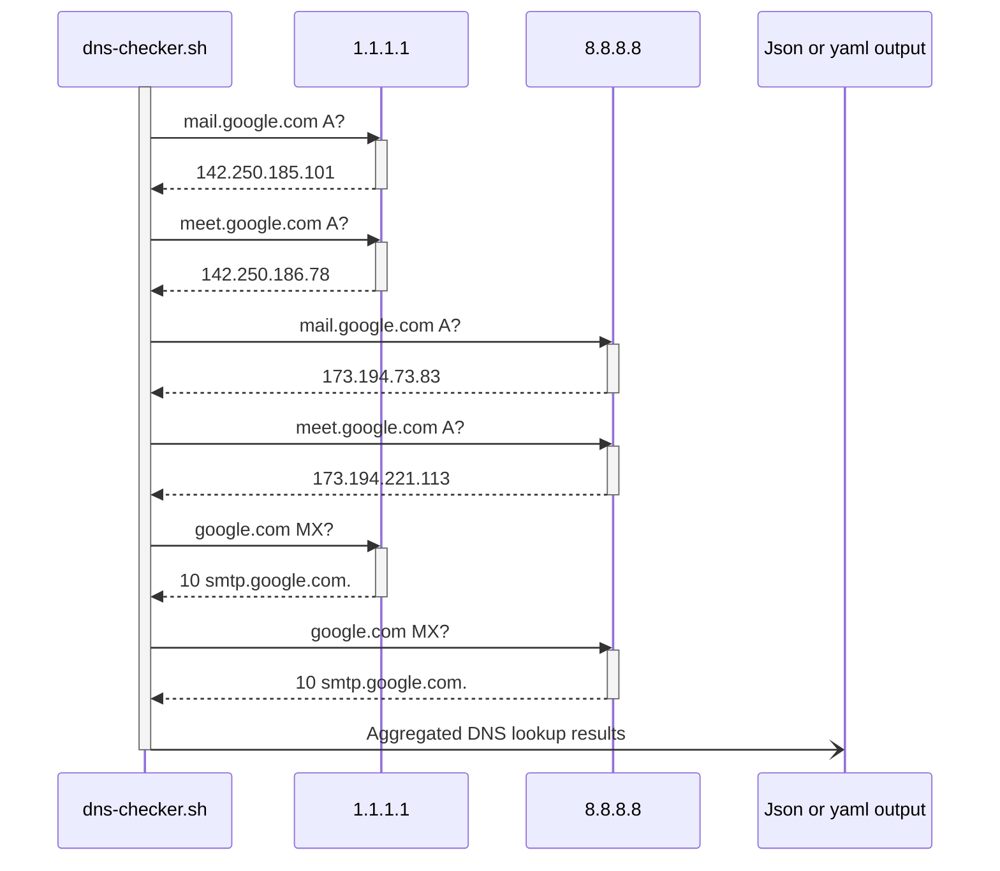

# About

Tool for lookup lots of DNS records from multiple nameservers.

Can be used for:
- DNS troubleshooting in complex infrastructures with multiple nameservers
- Troubleshooting different queries results from different networks
- DNS records inventory
- DNS records monitoring

Currently supported output formats:
- JSON
- Pretty JSON
- YAML



# Requirements

Required utilities:
- jq
- dig

Optional utilities:
- yq - if YAML format used

# How to use

1. Clone repository.
2. Create `config.json` or `config.yaml` configuration files. See the format below.
3. `chmod +x dns-checker.sh`
4. Execute `dns-checker.sh`

## Configuration format

Configuration file should be named `config.json` or `config.yaml`.

Default input is `config.json`, then try `config.yaml`.

| Parameter | Required | Value | Exaple |
| - | - | - | - |
| `.output` | No | Allowed values: `json`, `pretty_json`, `yaml`. Default is `json`. | `"output": "json"` |
| `.nameservers[]` | Yes | List of nameservers | `"nameservers": ["8.8.8.8","1.1.1.1"]` |
| `.lookup[]` | Yes | List of dicts | `"lookup": [{"zone": "google.com","domains": ["mail","meet"]}]` |
| `.lookup[].type` | No | Type of DNS record. Default is `A`. | `"type": "MX"` |
| `.lookup[].zone` | No | DNS zone. No default value. | `"zone": "google.com"` |
| `.lookup[].domains[]` | Yes | List of domains to lookup | `"lookup": [{"domains": ["mail.google.com","meet.google.com"]}]` |

YAML example:
```
---
output: json            # Values: json, pretty_json, yaml. Default is json. Optional. 
nameservers:            # List of nameservers. Required.
  - 8.8.8.8
  - 1.1.1.1
lookup:                 # List of records. Required.
  - type: A             # Record type. Default is A. Optional.
    zone: com           # Zone. Optional.
    domains:            # List of domains of specified zones. Required.
      - google
      - www.example
  - type: MX            # Record type. Default is A. Optional.
    domains:            # List of domains in FQDN format (no zone specified). Required.
      - google.com
      - example.com
```

JSON example:
```
{
  "output": "json",
  "nameservers": [
    "8.8.8.8",
    "1.1.1.1"
  ],
  "lookup": [
    {
      "type": "A",
      "zone": "com",
      "domains": [
        "google",
        "www.example"
      ]
    },
    {
      "type": "MX",
      "domains": [
        "google.com",
        "example.com"
      ]
    }
  ]
}
```

# Usage example

Configuration:
```
{
  "output": "pretty_json",
  "nameservers": [
    "8.8.8.8",
    "1.1.1.1"
  ],
  "lookup": [
    {
      "zone": "google.com",
      "domains": [
        "mail",
        "meet"
      ]
    }
  ]
}
```

Output:
```
{
  "data": [
    {
      "nameserver": "8.8.8.8",
      "zone": ".google.com",
      "domain": "mail",
      "fqdn": "mail.google.com",
      "type": "A",
      "lookup": [
        "173.194.73.83",
        "173.194.73.18",
        "173.194.73.19",
        "173.194.73.17"
      ]
    },
    {
      "nameserver": "8.8.8.8",
      "zone": ".google.com",
      "domain": "meet",
      "fqdn": "meet.google.com",
      "type": "A",
      "lookup": [
        "173.194.221.113",
        "173.194.221.102",
        "173.194.221.100",
        "173.194.221.139",
        "173.194.221.138",
        "173.194.221.101"
      ]
    },
    {
      "nameserver": "1.1.1.1",
      "zone": ".google.com",
      "domain": "mail",
      "fqdn": "mail.google.com",
      "type": "A",
      "lookup": [
        "142.250.185.101"
      ]
    },
    {
      "nameserver": "1.1.1.1",
      "zone": ".google.com",
      "domain": "meet",
      "fqdn": "meet.google.com",
      "type": "A",
      "lookup": [
        "142.250.186.78"
      ]
    }
  ],
  "errors": []
}
```
