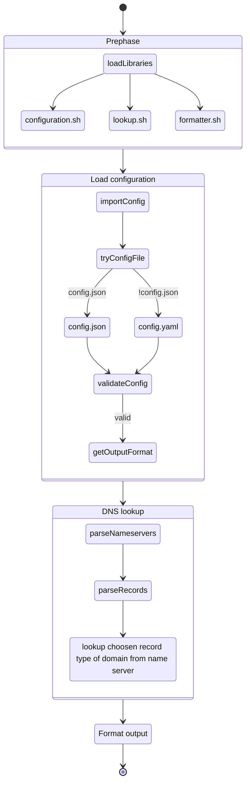

# Main



# Libraries

## lib/configuration.sh

Library for handle configuration file.

### function import_config

Imports json or yaml formatted configuration file. 

Configuration file should be named config.json or config.yaml. 

Exits if config does not exist or invalid (can not be parsed by jq or yq).

**Input**:
1. Script directory. Defined with `SCRIPT_DIR="${0%/*}"` in main script.

**Output**: json formatted config
```
{"output":"yaml","nameservers":["8.8.8.8","127.0.0.1"],"lookup":[{"type":"MX","domains":["google.com","example.com"]},{"zone":"com","domains":["google","www.example"]}]}
```

#### Exceptions

If config is not valid
```
jq: parse error: Unfinished JSON term at EOF at line 23, column 0
++ return 1
```

If config not found
```
Configuration file config.json/config.yaml not found.
++ return 1
```

### function define_output

Checks if output format is defined and allowed: `allowed_format=(json pretty_json yaml)`

Sets json if output format is not defined.

Exits if output format is not allowed.

**Input**:
1. Json formatted config

**Output**: result output format (string)

#### Examples

##### 1. *Input*:
```
{"output":"yaml","nameservers":["8.8.8.8","127.0.0.1"],"lookup":[{"type":"MX","domains":["google.com","example.com"]},{"zone":"com","domains":["google","www.example"]}]}
```

*Output*:
```
yaml
```

##### 2. *Input*:
```
{"output":"xml","nameservers":["8.8.8.8","127.0.0.1"],"lookup":[{"type":"MX","domains":["google.com","example.com"]},{"zone":"com","domains":["google","www.example"]}]}'
```

*Output*:
```
Format xml is not allowed
++ return 1
```

## lib/core.sh

Contains mostly used functions.

### function fail_if_empty

Checks if input is empty. Returns 1 if empty, 0 if not empty.

#### Examples:

##### 1. *Input*:
```
'8.8.8.8 1.1.1.1 127.0.0.1'
```

*Output*:
```
+ return 0
```

##### 2. *Input*:
```
''
```

*Output*:
```
+ return 1
```

### function dns_lookup

Performs DNS lookup with dig.

**Input**:
1. Nameserver (string)
2. Domain (string)
3. Zone (string)
4. Record type (string)

**Output**: answer section in short format

#### Examples:

##### 1. *Input*:
```
1.1.1.1
```

*Output*:
```
'a.root-servers.net.
b.root-servers.net.
c.root-servers.net.
d.root-servers.net.
e.root-servers.net.
f.root-servers.net.
g.root-servers.net.
h.root-servers.net.
i.root-servers.net.
j.root-servers.net.
k.root-servers.net.
l.root-servers.net.
m.root-servers.net.'
```

##### 2. *Input*:
```
8.8.8.8 google .com A
```

*Output*:
```
142.250.150.102
142.250.150.101
142.250.150.139
142.250.150.113
142.250.150.100
142.250.150.138
```

##### 3. *Input*:
```
1.1.1.1 google.com '' MX
```

*Output*:
```
10 smtp.google.com.
```

### function json_parse

Parses json key or list.

**Input**:
1. Search path
2. Json to parse

**Output**: array or value

#### Examples:

##### 1. *Input*:
```
.zone '{"zone":"com","domains":["google","www.example","github"]}'
```

*Output*:
```
com
```

##### 2. *Input*:
```
.type '{"zone":"com","domains":["google","www.example","github"]}'
```

*Output*:
```
null
```

##### 3. *Input*:
```
'.domains[]' '{"zone":"com","domains":["google","www.example","github"]}'
```

*Output*:
```
google www.example github
```

### function array_to_json

Transform bash variable to json formatted list.

**Input**:
1. Array

**Output**: json formatted array

#### Examples:

##### 1. *Input*:
```
www.example.com-v4.edgesuite.net. a1422.dscr.akamai.net. 2.16.53.33 2.16.53.27
```

*Output*:
```
["www.example.com-v4.edgesuite.net.","a1422.dscr.akamai.net.","2.16.53.33","2.16.53.27"]
```

##### 2. *Input*:
```
140.82.121.3
```

*Output*:
```
["140.82.121.3"]
```

### function format_error

Formatting error messages to json with description and message keys.

**Input**:
1. Error description
2. Error message/stderr

**Output**: json formatted error

#### Examples:

##### 1. *Input*:
```
'Error parsing domains list in item {"type":"MX"}' '+++ jq -c -r -M '\''.domains[]'\''
jq: error (at <stdin>:1): Cannot iterate over null (null)'
```

*Output*:
```
{"description":"Error parsing domains list in item {\"type\":\"MX\"}","message":"+++ jq -c -r -M '\''.domains[]'\''\njq: error (at <stdin>:1): Cannot iterate over null (null)"}
```

##### 2. *Input*:
```
'Error trying nameserver 127.0.0.1. Exclude 127.0.0.1 from the nameservers list.' ';; communications error to 127.0.0.1#53: connection refused
;; communications error to 127.0.0.1#53: connection refused
;; communications error to 127.0.0.1#53: connection refused
;; no servers could be reached'
```

*Output*:
```
{"description":"Error trying nameserver 127.0.0.1. Exclude 127.0.0.1 from the nameservers list.","message":";; communications error to 127.0.0.1#53: connection refused\n;; communications error to 127.0.0.1#53: connection refused\n;; communications error to 127.0.0.1#53: connection refused\n;; no servers could be reached"}
```

### function json_append_array

Append item to existing array.

**Input**:
1. Item to append
2. Existing json array

**Output**: json array with appended item

#### Examples:

##### 1. *Input*:
```
'{"description":"Error trying nameserver 127.0.0.1. Exclude 127.0.0.1 from the nameservers list.","message":";; communications error to 127.0.0.1#53: connection refused\n;; communications error to 127.0.0.1#53: connection refused\n;; communications error to 127.0.0.1#53: connection refused\n;; no servers could be reached"}' '[]'
```

*Output*:
```
[{"description":"Error trying nameserver 127.0.0.1. Exclude 127.0.0.1 from the nameservers list.","message":";; communications error to 127.0.0.1#53: connection refused\n;; communications error to 127.0.0.1#53: connection refused\n;; communications error to 127.0.0.1#53: connection refused\n;; no servers could be reached"}]
```

##### 2. *Input*:
```
'{"description":"Error parsing domains list in item {\"type\":\"MX\"}","message":"+++ jq -c -r -M '\''.domains[]'\''\njq: error (at <stdin>:1): Cannot iterate over null (null)"}' '[{"description":"Error trying nameserver 127.0.0.1. Exclude 127.0.0.1 from the nameservers list.","message":";; communications error to 127.0.0.1#53: connection refused\n;; communications error to 127.0.0.1#53: connection refused\n;; communications error to 127.0.0.1#53: connection refused\n;; no servers could be reached"}]'
```

*Output*:
```
[{"description":"Error trying nameserver 127.0.0.1. Exclude 127.0.0.1 from the nameservers list.","message":";; communications error to 127.0.0.1#53: connection refused\n;; communications error to 127.0.0.1#53: connection refused\n;; communications error to 127.0.0.1#53: connection refused\n;; no servers could be reached"},{"description":"Error parsing domains list in item {\"type\":\"MX\"}","message":"+++ jq -c -r -M '\''.domains[]'\''\njq: error (at <stdin>:1): Cannot iterate over null (null)"}]
```
