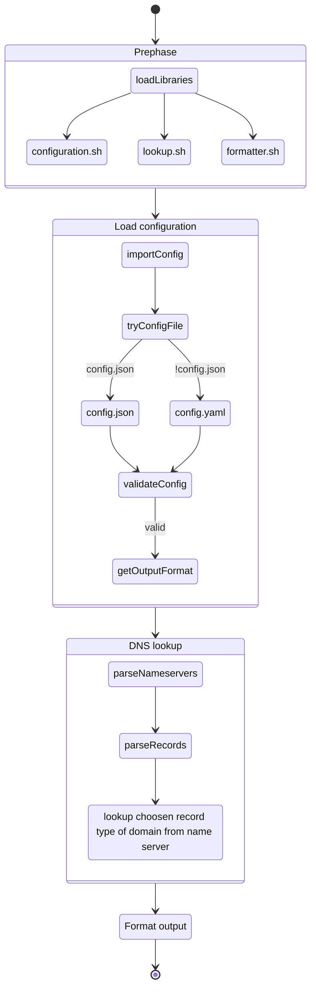

# Main

```mermaid
stateDiagram
    [*] --> Prephase
    state Prephase {
        loadLibraries --> configuration.sh
        loadLibraries --> lookup.sh
        loadLibraries --> formatter.sh
    }

    Prephase --> loadConfig
    loadConfig: Load configuration
    state loadConfig {
        importConfig --> tryConfigFile
        tryConfigFile --> config.json: config.json
        tryConfigFile --> config.yaml: !config.json
        config.json --> validateConfig
        config.yaml --> validateConfig
        validateConfig --> getOutputFormat: valid
    }

    loadConfig --> lookup
    lookup: DNS lookup
    state lookup {
        parseNameservers --> parseRecords
        parseRecords --> dig
        dig: lookup choosen record type of domain from name server
    }

    lookup --> formatOutput
    formatOutput: Format output

    formatOutput --> [*]
```

# Libraries

- [configuration.sh](./lib_configuration.md)
- [lookup.sh](./lib_lookup.md)
- [formatter.sh](./lib_formatter.md)
