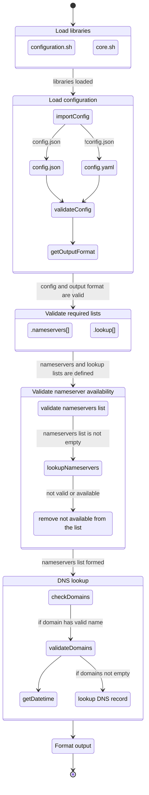

# Main

```mermaid
stateDiagram
    [*] --> loadLibraries
    loadLibraries: Load libraries
    state loadLibraries {
        configuration.sh
        core.sh
    }

    loadLibraries --> loadConfig: libraries loaded
    loadConfig: Load configuration
    state loadConfig {
        importConfig --> config.json: config.json
        importConfig --> config.yaml: !config.json
        config.json --> validateConfig
        config.yaml --> validateConfig
        validateConfig --> getOutputFormat
    }

    loadConfig --> validateLists: config and output format are valid
    validateLists: Validate required lists
    state validateLists {
        checkNameserversList: .nameservers[]
        checkLookupList: .lookup[]
    }

    validateLists --> tryNameservers: nameservers and lookup lists are defined
    tryNameservers: Validate nameserver availability
    state tryNameservers {
        checkList --> lookupNameservers: nameservers list is not empty
        lookupNameservers --> unsetNotValid: not valid or available
        checkList: validate nameservers list
        unsetNotValid: remove not available from the list
    }

    tryNameservers --> lookup: nameservers list formed
    lookup: DNS lookup
    state lookup {
        checkDomains --> validateDomains: if domain has valid name
        validateDomains --> getDatetime
        validateDomains --> lookupDNSRecord: if domains not empty
        lookupDNSRecord: lookup DNS record
    }

    lookup --> formatOutput
    formatOutput: Format output

    formatOutput --> [*]
```

# Libraries

- [configuration.sh](./lib_configuration.md) Library for handle configuration file.
- [core.sh](./lib_core.md) Contains mostly used functions.
